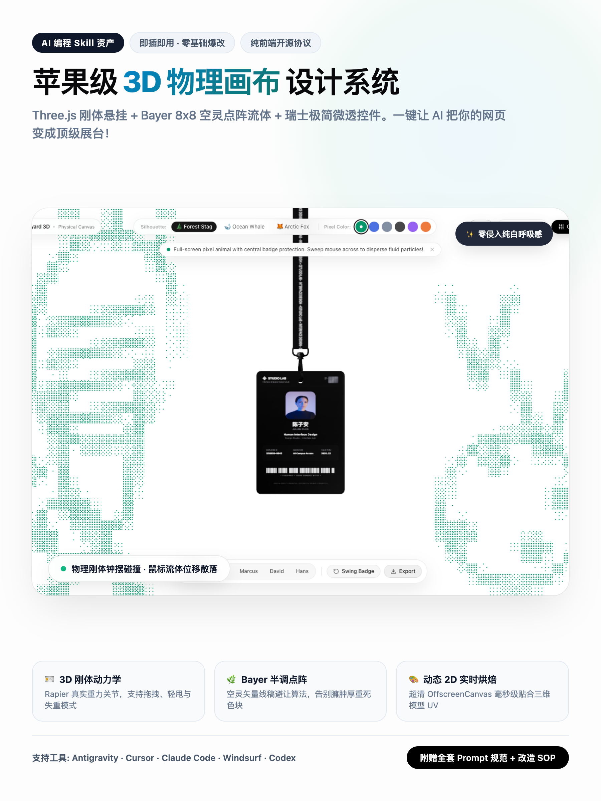
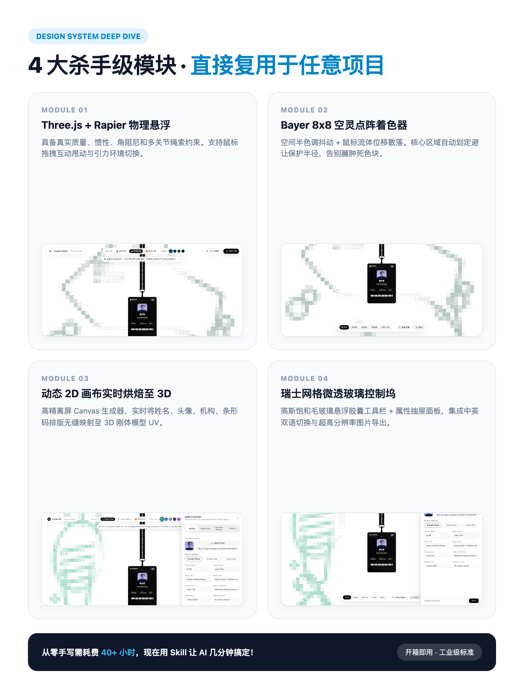
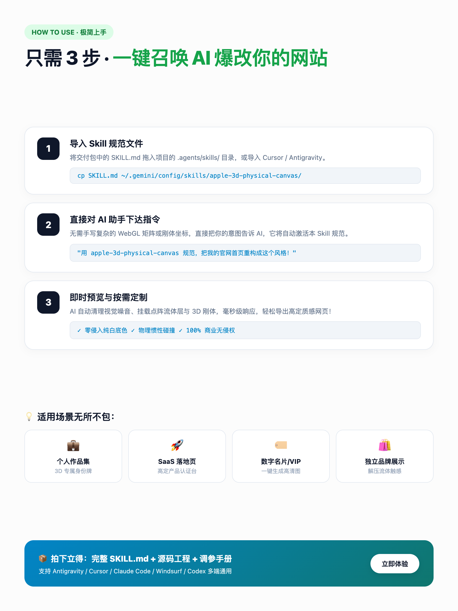

# 🍏 Apple 3D Physical Canvas | 苹果级极简物理画布 UI/UX 设计系统 Skill

<div align="center">

[](https://opensource.org/licenses/MIT)
[](https://threejs.org/)
[](https://docs.pmnd.rs/react-three-fiber)
[](https://rapier.rs/)
[](https://tree-oil.github.io/lanyard-showcase/)

**纯白呼吸感画布 · WebGL2 Bayer 8x8 空灵半调点阵流体 · Three.js + Rapier 3D 刚体悬挂物理 · 动态 2D 离屏烘焙 UV**

[🌐 在线实机体验 (Live Demo)](https://tree-oil.github.io/lanyard-showcase/) · [📦 完整源码工程 (Full Source)](https://github.com/Tree-oil/lanyard-showcase)

</div>

---

## 📸 视觉画廊 (Visual Showcase)

<div align="center">
  
  
</div>

<div align="center">
  
</div>

---

## 🌟 什么是 Apple 3D Physical Canvas Skill？

本 Skill 是一套专为 **AI 编程助手（Antigravity、Cursor、Claude Code、Windsurf、Codex / ChatGPT）** 沉淀的标准前端设计规范。

当你向 AI 描述“想要做一个有质感的现代网页”时，传统 AI 往往会陷入**赛博朋克大黑底、粗糙霓虹渐变、以及臃肿色块**的千篇一律。  
本 Skill 将顶级的工业级设计规范、着色器数学公式、物理刚体参数和排版法则全部打包成规范化结构，一句话即可驱动 AI 将任意网页（个人作品集、SaaS 落地页、数字身份名片、奢侈品展示）重构成**千万级苹果高定质感**！

---

## 🛠️ 4 大杀手级核心组件

1. **🪪 Three.js + Rapier 3D 刚体动力学**：
   - 具备真实质量、惯性、角阻尼（Angular Damping）和多关节绳索约束。
   - 支持鼠标拖拽甩动与太空失重（0.0G）/ 月球低重力（0.16G）/ 地球标准（1.0G）引力切换。

2. **🌿 Bayer 8x8 空灵半调点阵着色器**：
   - 纯净白底（`#ffffff` / `#f8fafc`），彻底剔除大块死色填充。
   - 墨水浓度硬截断（`0.15 ~ 0.32`），中央核心展品自动划定避让保护半径，鼠标滑过产生流体粒子位移散落。

3. **🎨 动态 2D 画布实时烘焙至 3D UV**：
   - 超高分辨率（2048x2048）离屏 Canvas 毫秒级生成。
   - 身份铭牌、肖像照片、金色 NFC 智能芯片与高精度条形码实时贴合 3D 模型表面。

4. **💎 瑞士网格微透玻璃控制坞**：
   - 高斯饱和毛玻璃胶囊悬浮工具栏 + 属性微调抽屉面板。
   - 支持中英双语无刷新切换与高分辨率透明 PNG 一键导出。

---

## 🚀 极简 3 步上手指南

### 第一步：导入 Skill 文件
将仓库中的 [`SKILL.md`](./SKILL.md) 放入你的 AI 助手规则目录：

- **Antigravity / Gemini CLI**：
  ```bash
  mkdir -p ~/.gemini/config/skills/apple-3d-physical-canvas
  cp SKILL.md ~/.gemini/config/skills/apple-3d-physical-canvas/SKILL.md
  ```
- **Cursor**：
  将 `SKILL.md` 内容复制到项目根目录的 `.cursorrules` 或 `.agents/skills/apple-3d-physical-canvas/SKILL.md`。
- **Claude Code / Windsurf**：
  直接在对话中将 `SKILL.md` 作为 Context / Memory 导入。

### 第二步：召唤 AI 执行改造
直接对 AI 编程助手输入以下提示词：

> *“请激活并遵循 `apple-3d-physical-canvas` 规范，将我的项目首页重构为具有苹果极简纯白底色、Bayer 空灵半调点阵背景和 3D 物理悬挂交互的设计风格！”*

### 第三步：即时享受高定质感
AI 将自动清理视觉噪音、挂载 WebGL 点阵底层、注入 3D 刚体组件，完成全站蜕变。

---

## 🔗 相关链接

- **在线交互体验 Demo**：[https://tree-oil.github.io/lanyard-showcase/](https://tree-oil.github.io/lanyard-showcase/)
- **工牌完整网站源码**：[https://github.com/Tree-oil/lanyard-showcase](https://github.com/Tree-oil/lanyard-showcase)
- **作者主页**：[https://github.com/Tree-oil](https://github.com/Tree-oil)

---

## 📄 License

[MIT License](LICENSE) © 2026 Tree-oil.
